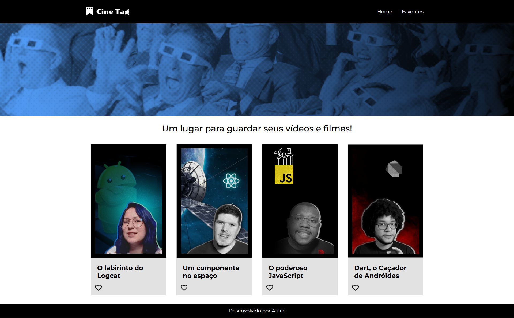

# 🎬 Cinetag - Movie Catalog Application

**Cinetag** is a responsive web application built with **ReactJS** and **Tailwind CSS**, enabling users to explore and manage a curated list of movies. The application showcases dynamic routing, interactive components, and a clean, responsive design.

## 📸 Project Preview

  

## 🚀 Project Overview

Cinetag offers users the ability to:

- Browse a collection of movies.
- View detailed information about each movie.
- Navigate through different sections using dynamic routing.

The application is designed with a focus on user experience, ensuring seamless navigation and responsiveness across various devices.

## 🌟 Features

- 🔄 **Dynamic Routing**  
  Implemented using React Router for seamless navigation between pages.

- 🎯 **Interactive UI Components**  
  Engaging user interface elements built with React and styled using Tailwind CSS.

- 📱 **Responsive Design**  
  Ensures optimal viewing experience on mobile, tablet, and desktop devices.

- 🧩 **Reusable Components**  
  Modular React components for maintainable and scalable codebase.

## 🛠️ Technologies Used

- **ReactJS** – JavaScript library for building user interfaces.
- **Tailwind CSS** – Utility-first CSS framework for rapid UI development.
- **React Router** – Declarative routing for React applications.
- **Vite** – Next-generation frontend build tool for fast development.

## 📚 Learning Objectives

This project was developed to enhance skills in:

- Implementing dynamic routing with React Router.
- Managing state and effects using React hooks.
- Designing responsive layouts with Tailwind CSS.
- Structuring React components for scalability and maintainability.

## 🌐 Live Demo

Experience the live application here:  
👉 [cinetag-cyan.vercel.app](https://cinetag-cyan.vercel.app/)

## 📄 License

This project is intended for educational and demonstrative purposes.  
All content and functionalities are fictional and do not represent any real-world application.

---
